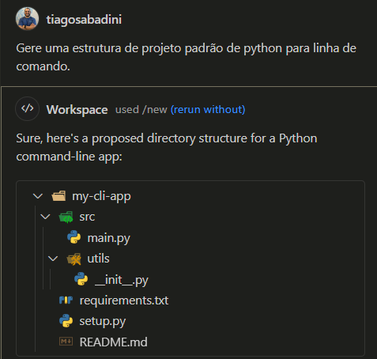
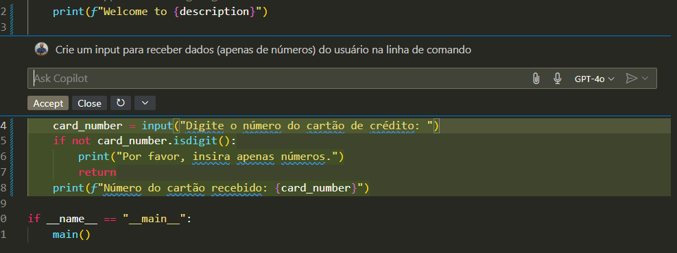
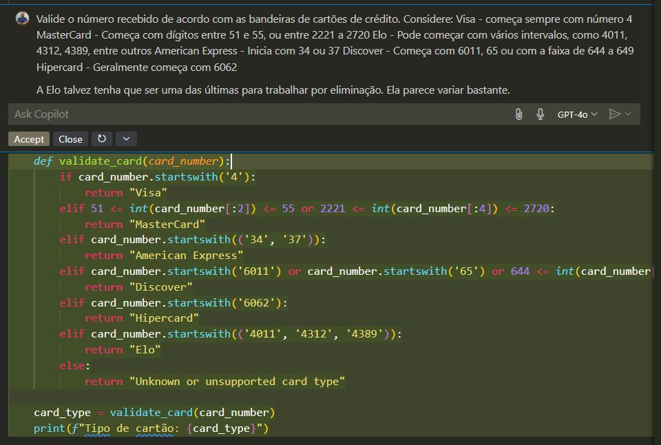
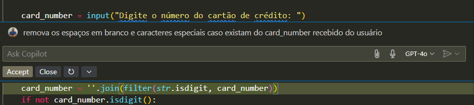

# My CLI App

## Description
Este projeto foi escrito quase que 100% com o Chat do copilot

## Geração da estrutura do projeto

## Criação da etapa de captura do número do cartão de crédito

## Criação da função para validar de acordo com a bandeira

## Realizando alguns tratamentos no dado recebido do usuário
